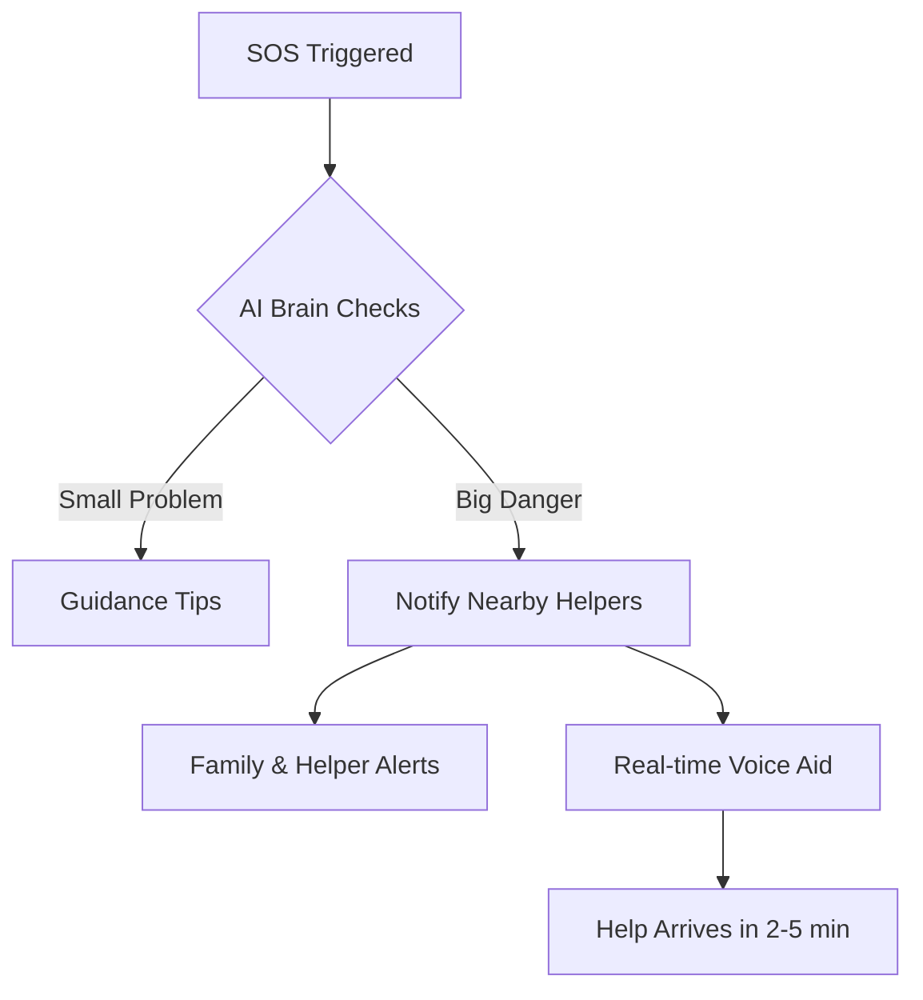
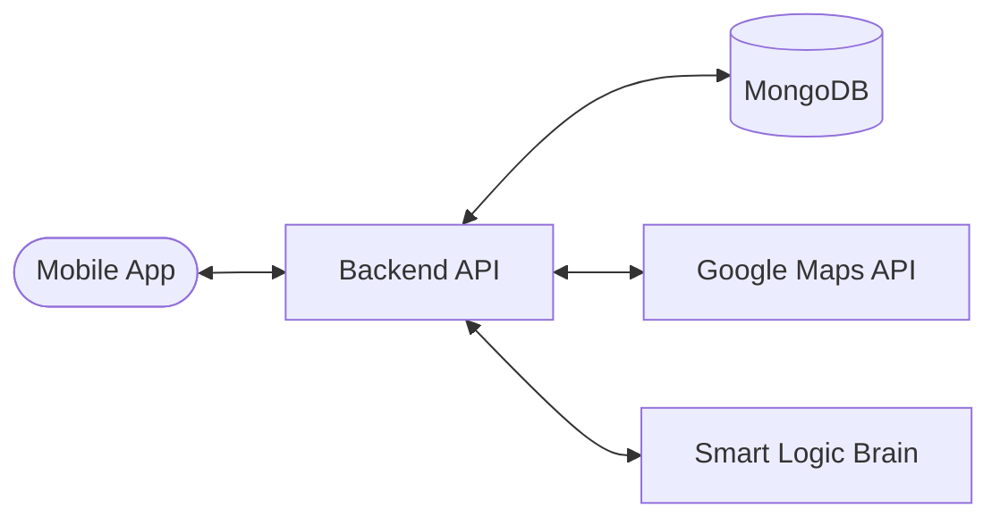

# 🚀 LifeLine: Your Personal Emergency & Safety Helper

**LifeLine** is a hyper-local emergency response system. It connects people in immediate danger with nearby verified helpers (doctors, nurses, or trained civilians), ensuring help arrives in minutes—not hours.

---

## 🟢 1. Problem (Very Simple)
Let’s think about real life. Sometimes emergencies happen:
*   🏃‍♂️ You feel unsafe at night
*   ❤️ Someone gets a heart attack
*   🚲 Bike accident on road
*   👴 Old person falls
*   📍 You are stuck alone somewhere

**Today’s situation:**
*   ❌ Ambulance takes 30–40 minutes
*   ❌ Police come late
*   ❌ No one nearby knows you need help
*   ❌ You panic & don't know first aid

**But truth is:**
👉 A doctor may be 200 meters away
👉 A nurse may live nearby
👉 A helper may be on the next street

✅ **Main Problem:** In emergencies, people cannot quickly find nearby help, so response is slow and situations become dangerous.

---

## ✅ 2. Solution (Simple Idea)
**LifeLine App** finds nearby helpers instantly.
Just like **Uber finds a driver** or **Zomato finds food**, **LifeLine finds emergency help**.

Instead of waiting 30 minutes… 👉 **help comes in 2–5 minutes.**

---

## 📊 3. How It Works (Very Easy Steps)

### Step 1 — Press SOS 🔴
You press the SOS button, OR your phone automatically detects a **fall, crash, or unconscious state**.

### Step 2 — AI Calls You (within 5 seconds) ⭐
The app calls you like a smart friend and asks: *"What happened? Are you safe? Medical or safety problem?"* You speak or tap.

### Step 3 — AI Understands the Problem 🧠
*   **Small problem?** (lost, minor injury) → Gives tips only.
*   **Big danger?** (heart attack, accident) → Sends emergency alerts.
*   *(This stops false alarms!)*

### Step 4 — Find Nearby Helpers 🤝
The app finds the **nearest doctor, nurse, or volunteer**. Like Uber matching, it picks whoever is closest.

### Step 5 — Alerts Sent 🔔
System sends your **live location** and a **loud alert** to nearby helpers and your family.

### Step 6 — AI Guides You 🗣️
While help is coming, the app talks to you: *"Stay calm. Apply pressure. Help is 2 minutes away."* So you don’t panic.

### Step 7 — Help Arrives Fast ✅
Instead of 30 minutes, help reaches you in **2–5 minutes**. Life saved.



---

## 🏗️ 4. System Architecture


---

## 🟢 5. Main Features (Easy List)
*   **🚨 Emergency SOS:** One tap to call for help with live tracking.
*   **🧠 AI Assistant:** Talks to you, understands the problem, and decides action.
*   **🤝 Nearby Helpers:** Connects you to doctors, nurses, and volunteers.
*   **🛡️ Safety Mode:** Daily use features like "share trip" and "unsafe area alerts".
*   **🏃‍♂️ Auto Detection:** Fall and crash detection using phone sensors.
*   **📶 Offline Mode:** Works using SMS alerts when internet is down.

---

## 📂 6. Project Structure
```text
LifeLine/
├── LifeLine-Backend/     # Node.js + Express API (The Brain)
└── Lifeline-Frontend/    # React Native Mobile App (The Face)
    ├── app/              # Expo Router (Pages & Navigation)
    ├── src/features/     # SOS, Auth, & Tracking Logic
    ├── src/theme/        # Modern Design System
    └── assets/           # Images & Icons
```

---

## 🛠️ 7. Tech Stack (Simple)
*   **React Native:** To build the mobile app for Android & iPhone.
*   **Node + Express:** To run the fast backend server.
*   **MongoDB:** To safely store data about helpers and users.
*   **Google Maps:** To find the exact location of the emergency.
*   **AI Logic:** Simple smart logic to decide the best path for help.

---

## 💡 8. The Vision
**"Community saves community."**
> **Example for Judges:** *"If my mother falls while walking alone, instead of waiting 30 minutes for an ambulance, our app finds a nurse just 300 meters away. She reaches in 3 minutes and helps her."*

✅ **LifeLine is an AI-powered app that quickly connects people in danger with nearby helpers and guides them step-by-step to stay safe.**
